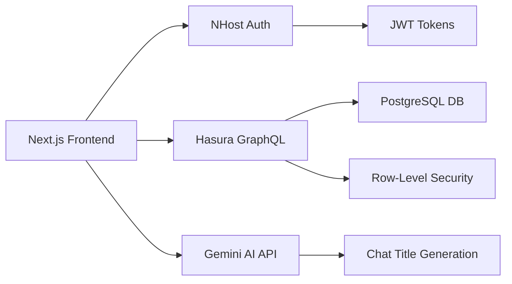

# 🐭 mouseAI: AI-Powered Chat Application

A modern, intelligent chat application built with **Next.js 14**, **NHost Authentication**, **Hasura GraphQL**, and **Google Gemini AI**. Features real-time messaging, AI-powered chat titles, and enterprise-grade security.


## ✨ Features

### 🤖 AI-Powered Intelligence
- **Smart Chat Titles**: Google Gemini AI automatically generates descriptive titles from first messages
- **Intelligent Fallback**: Rule-based title generation when AI is unavailable  
- **Real-time Processing**: Async AI processing with visual loading indicators
- **Context Awareness**: AI understands message context for better title generation

### 🔐 Enterprise Security
- **NHost Authentication**: Secure JWT-based authentication with email verification
- **Row-Level Security**: Database-level isolation ensuring users only see their own data
- **Environment Protection**: All API keys and secrets secured via environment variables
- **HTTPS Ready**: Production-ready security configurations

### 💬 Advanced Chat Features
- **Real-time Messaging**: Instant message delivery with optimistic updates
- **Message History**: Persistent chat storage with PostgreSQL
- **Typing Indicators**: Visual feedback during AI response generation
- **Markdown Support**: Rich text formatting with **bold** and *italic* text
- **Error Recovery**: Comprehensive error handling with user-friendly messages
- **Responsive Design**: Works perfectly on desktop and mobile devices

### 🎨 Modern UI/UX
- **Clean Interface**: Minimalist design inspired by modern chat applications
- **Dark/Light Themes**: Automatic theme detection and switching
- **Smooth Animations**: Polished transitions and loading states
- **Accessible**: WCAG compliant with keyboard navigation support

## 🏗️ Architecture



## 🛠️ Tech Stack

### Frontend
- **Framework**: Next.js 14 with App Router
- **Language**: TypeScript
- **Styling**: Tailwind CSS + Shadcn/ui components
- **State Management**: React Hooks (useState, useEffect)
- **Icons**: Lucide React

### Backend & Database
- **Authentication**: NHost (Auth0-like service)
- **Database**: PostgreSQL with Hasura GraphQL Engine
- **Real-time**: GraphQL subscriptions
- **Security**: Row-Level Security (RLS) policies

### AI & APIs
- **AI Provider**: Google Gemini AI (gemini-1.5-flash)
- **API Routes**: Next.js API routes for secure AI calls
- **Error Handling**: Comprehensive fallback systems

### DevOps & Deployment
- **Package Manager**: pnpm
- **Environment**: .env.local configuration
- **Version Control**: Git with GitHub
- **Code Quality**: TypeScript strict mode

## 🚀 Quick Start

### Prerequisites
- Node.js 18+ 
- pnpm (recommended) or npm
- NHost account
- Google Gemini API key

### 1. Clone & Install
```bash
git clone https://github.com/shreyahhh/My-Chatbot-MOUSE.git
cd My-Chatbot-MOUSE
pnpm install
```

### 2. Environment Setup
Create `.env.local` file:
```env
# NHost Configuration
NEXT_PUBLIC_NHOST_SUBDOMAIN=your-nhost-subdomain
NEXT_PUBLIC_NHOST_REGION=your-nhost-region

# Google Gemini AI
GEMINI_API_KEY=your-gemini-api-key
```

### 3. Run Development Server
```bash
pnpm dev
```

Visit `http://localhost:3000` to see the application.

## 📊 Database Schema

### `chats` table
```sql
CREATE TABLE chats (
    id UUID PRIMARY KEY DEFAULT gen_random_uuid(),
    title TEXT NOT NULL,
    user_id UUID NOT NULL REFERENCES auth.users(id),
    created_at TIMESTAMP WITH TIME ZONE DEFAULT NOW()
);

-- Row-Level Security
ALTER TABLE chats ENABLE ROW LEVEL SECURITY;

CREATE POLICY "Users can manage own chats" ON chats
    FOR ALL USING (user_id = auth.uid());
```

### `messages` table  
```sql
CREATE TABLE messages (
    id UUID PRIMARY KEY DEFAULT gen_random_uuid(),
    chat_id UUID NOT NULL REFERENCES chats(id) ON DELETE CASCADE,
    user_id UUID NOT NULL REFERENCES auth.users(id),
    content TEXT NOT NULL,
    role TEXT NOT NULL CHECK (role IN ('user', 'assistant')),
    created_at TIMESTAMP WITH TIME ZONE DEFAULT NOW()
);

-- Row-Level Security
ALTER TABLE messages ENABLE ROW LEVEL SECURITY;

CREATE POLICY "Users can manage own messages" ON messages
    FOR ALL USING (user_id = auth.uid());
```

## 🔧 Configuration

### NHost Setup
1. Create account at [nhost.io](https://nhost.io)
2. Create new project
3. Get subdomain and region from project settings
4. Enable email/password authentication
5. Set up database permissions (see Database Schema section)

### Gemini AI Setup
1. Get API key from [Google AI Studio](https://makersuite.google.com/app/apikey)
2. Add to `.env.local` as `GEMINI_API_KEY`
3. The app automatically generates smart titles like:
   - "How to bake cookies?" → "Homemade Chocolate Chip Cookies"
   - "Weather forecast help" → "Weather Information Assistance" 
   - "JavaScript tutorials" → "JavaScript Learning Resources"

### API Routes
- `POST /api/generate-title` - Secure Gemini AI title generation
- Handles API key validation and error responses
- Returns JSON: `{ title: string }` or `{ error: string }`

## 🎯 Usage Examples

### Creating a New Chat
1. Click "New Chat" button
2. Type your first message: "How to make pasta?"
3. Watch the title automatically change from "Generating title..." to "Homemade Pasta Cooking Guide"
4. Continue the conversation naturally

### AI Title Generation Flow
```typescript
// 1. User sends first message
const userMessage = "How do I learn React?"

// 2. AI processes message (async)
const aiTitle = await generateChatTitle(userMessage)
// Result: "React Learning Guide"

// 3. Fallback if AI fails
const fallbackTitle = userMessage.substring(0, 30) + "..."
// Result: "How do I learn React?..."
```

The AI analyzes your first message and creates contextual titles:
- **Cooking**: "How to bake bread?" → "Homemade Bread Baking"
- **Programming**: "React hooks tutorial" → "React Hooks Learning Guide"  
- **General**: "What's the weather like?" → "Weather Information Query"

## 📁 Project Structure

```
├── app/
│   ├── globals.css          # Global styles and Tailwind configuration
│   ├── layout.tsx           # Root layout component with NHost provider
│   ├── page.tsx             # Main chat application
│   └── api/
│       └── generate-title/  # Gemini AI API route
├── components/
│   ├── chat/
│   │   ├── message-bubble.tsx    # Individual message component
│   │   └── typing-indicator.tsx  # Loading animation component
│   ├── providers/
│   │   └── nhost-provider.tsx    # NHost authentication provider
│   └── ui/                  # shadcn/ui components
├── lib/
│   ├── constants.ts         # Application configuration
│   ├── graphql.ts           # GraphQL queries and client
│   ├── nhost.ts             # NHost client configuration
│   ├── types.ts             # TypeScript type definitions
│   ├── utils.ts             # General utility functions
│   ├── services/
│   │   └── gemini-service.ts     # Gemini AI integration
│   └── utils/
│       ├── chat.ts          # Chat-related utility functions
│       └── markdown.ts      # Markdown parsing utilities
└── README.md
```

## 🚨 Troubleshooting

### Common Issues

**Authentication Errors**
- Verify NHost subdomain and region in `.env.local`
- Check if email verification is enabled in NHost console
- Ensure user has verified their email address

**AI Title Generation Not Working**
- Verify `GEMINI_API_KEY` is set correctly
- Check browser console for API errors
- Ensure you have Gemini API quota remaining

**GraphQL Errors**
- Verify Row-Level Security policies are set up
- Check that user is authenticated
- Ensure database tables exist with correct schema

**Build Errors**
- Run `pnpm install` to ensure all dependencies are installed
- Check TypeScript errors with `pnpm build`
- Verify all environment variables are set

### Debug Mode

Enable debug logging by checking browser console for prefixed messages:
- `[v0]` - GraphQL request/response details
- `[NHost]` - Authentication status
- `[App]` - AI title generation process
- `[Gemini]` - AI service integration

## 🚀 Deployment

### Production Build
```bash
pnpm build
pnpm start
```

### Environment Variables for Production
```env
NEXT_PUBLIC_NHOST_SUBDOMAIN=your-production-subdomain
NEXT_PUBLIC_NHOST_REGION=your-production-region
GEMINI_API_KEY=your-production-gemini-key
```

### Deployment Platforms
- **Vercel** (recommended for Next.js)
- **Netlify**
- **Docker container**
- **Traditional hosting**

## 🤝 Contributing

1. Fork the repository
2. Create feature branch: `git checkout -b feature/amazing-feature`
3. Commit changes: `git commit -m 'Add amazing feature'`
4. Push to branch: `git push origin feature/amazing-feature`
5. Open a Pull Request

## 📝 License

This project is licensed under the MIT License - see the [LICENSE](LICENSE) file for details.

## 🙏 Acknowledgments

- **NHost** for authentication and database hosting
- **Hasura** for GraphQL API layer
- **Google** for Gemini AI integration
- **Vercel** for Next.js framework
- **Shadcn/ui** for beautiful UI components

---

<div align="center">
  <strong>Built with ❤️ by the mouse team</strong>
  <br>
  <sub>Making AI chat applications accessible to everyone</sub>
</div>
